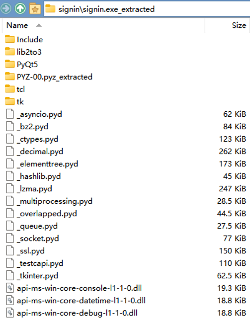

# [PyInstaller](https://github.com/pyinstaller/pyinstaller)
> Freeze (package) Python programs into stand-alone executables

`--onefile`

## Conda 问题
conda 的依赖有些问题，会导致 PyInstaller 打包的结果非常大，并且还不能正常运行。

解决方法是用 venv 或者 conda 创建虚拟环境，用 pip 安装需要的包，再用 PyInstaller 打包。

```sh
python -m venv setup-env
cd setup-env\Scripts
.\pip install ...
.\pip install pyinstaller
cd ..\..
.\setup-env\Scripts\pyinstaller --onefile main.py
```

[python - PyInstaller with Pandas creates over 500 MB exe - Stack Overflow](https://stackoverflow.com/questions/43886822/pyinstaller-with-pandas-creates-over-500-mb-exe)

## Unpacking
[pyinstaller/archive\_viewer.py at develop - pyinstaller/pyinstaller](https://github.com/pyinstaller/pyinstaller/blob/develop/archive_viewer.py)

[extremecoders-re/pyinstxtractor: PyInstaller Extractor](https://github.com/extremecoders-re/pyinstxtractor)

[反编译pyinstaller打包的exe文件\_zzzzls 的博客 - CSDN博客](https://blog.csdn.net/qq_36078992/article/details/103596170)

### PyInstaller Extractor
[extremecoders-re/pyinstxtractor: PyInstaller Extractor](https://github.com/extremecoders-re/pyinstxtractor)

会自动修复文件头，但需要执行时的 Python 与被解包的 Python 版本相同？

会提取到 cwd 下的子目录里：



## 加密
[针对pyinstaller两个情况的逆向 - Th0r安全](https://mp.weixin.qq.com/s/kqD87mMXYPIVD-QhRkeOFg)